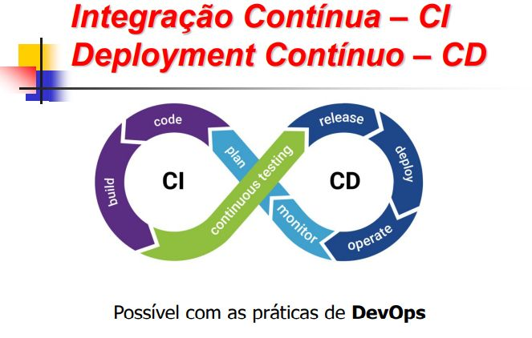

# Integração Contínua (CI) e Deployment Contínuo (CD)



## Introdução

CI/CD é um conjunto de práticas utilizadas no desenvolvimento moderno de software para automatizar processos como integração de código, testes, build e deploy. Essas práticas fazem parte da cultura DevOps, que busca aproximar desenvolvimento e operações através de automação, integração contínua e entrega rápida de software.

O GitHub Actions é uma ferramenta utilizada para implementar pipelines de CI/CD diretamente dentro do GitHub.

**Documentação de uso: https://docs.github.com/pt/actions**
OBS: Na documentação tem todo o aprendizado teórico.

## O que é CI (Continuous Integration)

Continuous Integration (Integração Contínua) é a prática de integrar alterações de código frequentemente em um repositório principal.

A principal ideia da CI é detectar problemas rapidamente. Sendo assim, sempre que um desenvolvedor envia código para o repositório (por exemplo, utilizando `git push`), processos automáticos são executados para verificar se o sistema continua funcionando corretamente.

Esses processos normalmente incluem:

- Instalação de dependências
- Compilação do projeto
- Execução de testes
- Verificação de formatação e qualidade do código

Caso algum erro aconteça, o pipeline falha automaticamente, permitindo identificar o problema antes que ele avance para produção.


### Build

O processo de build consiste em transformar o código-fonte em algo executável ou utilizável.

Dependendo do projeto, o build pode significar:

- Compilar um programa em C/C++
- Gerar um APK Android
- Criar uma imagem Docker
- Empacotar uma aplicação Python
- Gerar arquivos estáticos de um site

Exemplo de build no GitHub Actions:

```yaml
- name: Build
  run: docker build -t meu_app .
```


### Testes Automatizados

Os testes automatizados verificam se o comportamento do sistema continua correto após alterações no código.
Eles são fundamentais dentro da CI porque permitem detectar erros automaticamente sem necessidade de testes manuais.

Exemplo:

```yaml
- name: Run tests
  run: pytest
```


### Code

A etapa "Code" representa o desenvolvimento do software em si.

Ela envolve:

- Criação de funcionalidades
- Commits
- Branches
- Pull Requests
- Revisões de código

Todo o fluxo de CI/CD começa a partir dessas alterações feitas pelos desenvolvedores.


## O que é CD (Continuous Delivery / Continuous Deployment)
Após o código passar por todas as verificações da CI, entra a etapa de CD.

CD pode possuir dois significados:

- Continuous Delivery
- Continuous Deployment

Ambos possuem relação com automatização de entrega e deploy do software.


### 1 - Continuous Delivery

Na Continuous Delivery, o sistema prepara automaticamente tudo para deploy, mas a publicação final ainda depende de aprovação manual.

Fluxo:

```text
push -> testes -> build -> pronto para deploy
```

Esse modelo é muito utilizado quando a empresa deseja manter controle humano antes de atualizar produção.


### 2 - Continuous Deployment
Na Continuous Deployment, todo o processo é automático.

Se o código passar em todos os testes:

- o build é gerado
- o deploy acontece automaticamente

Fluxo:

```text
push -> testes -> build -> deploy automático
```

Esse modelo é muito comum em:

- aplicações web
- SaaS
- microsserviços

Já em sistemas críticos, como aeronáutica ou sistemas embarcados sensíveis, normalmente existe aprovação manual antes do deploy.


### Deploy

Deploy é o processo de disponibilizar o software em algum ambiente para execução.

Exemplos:

- Servidores cloud
- Containers Docker
- Kubernetes
- VPS
- Raspberry Pi
- AWS

Em GitHub Actions, é possível automatizar completamente o deploy após os testes.


### Monitoramento (Monitor)

Após o deploy, o sistema precisa ser monitorado.

O monitoramento serve para acompanhar:

- Logs
- Erros
- Uso de CPU e memória
- Disponibilidade
- Performance

Ferramentas comuns:

- Prometheus
- Grafana
- Sentry

Essa etapa é importante porque garante que o sistema continue funcionando corretamente após entrar em produção.


### Operação (Operate)

A etapa de operação representa a manutenção contínua do sistema.

Ela inclui:

- Correção de falhas
- Atualizações
- Escalabilidade
- Administração da infraestrutura

Essa parte normalmente é associada à equipe de operações ou SRE.


### Planejamento (Plan)

Antes do desenvolvimento, existe a etapa de planejamento.

Ela envolve:

- Backlog
- Issues
- Roadmap
- Organização de tarefas

Ferramentas muito utilizadas:

- GitHub Issues
- Jira
- Azure DevOps


### Release

Uma release representa uma versão oficial do software.

Exemplos:

```text
v1.0.0
v2.3.1
```

No GitHub, releases normalmente utilizam:

- Tags
- Changelog
- Histórico de versões


## DevOps

DevOps é a cultura que une desenvolvimento e operações através de automação e integração contínua.

Os principais objetivos do DevOps são:

- Automatizar processos
- Entregar software mais rapidamente
- Melhorar qualidade
- Reduzir falhas
- Facilitar deploys

O GitHub Actions é uma ferramenta que implementa práticas DevOps.

---

# Relação entre GitHub Actions e CI/CD

O GitHub Actions permite criar workflows automatizados dentro do GitHub.

Esses workflows podem ser acionados por eventos como:

```text
push
pull_request
release
schedule
```

Quando um evento acontece, o GitHub Actions executa automaticamente as tarefas definidas no pipeline.


## Estrutura Básica de um Workflow

Exemplo simples de CI:

```yaml
name: CI

on: [push]

jobs:
  test:
    runs-on: ubuntu-latest

    steps:
      - uses: actions/checkout@v4

      - name: Instalar dependências
        run: pip install -r requirements.txt

      - name: Rodar testes
        run: pytest
```

Nesse exemplo:

- O workflow é executado em todo `push`
- O repositório é baixado
- Dependências são instaladas
- Os testes são executados automaticamente

---

## Referências de vídeos
https://www.youtube.com/watch?v=F51HlrEeedw

https://www.youtube.com/watch?v=df_WMXk7JxE&t=208s